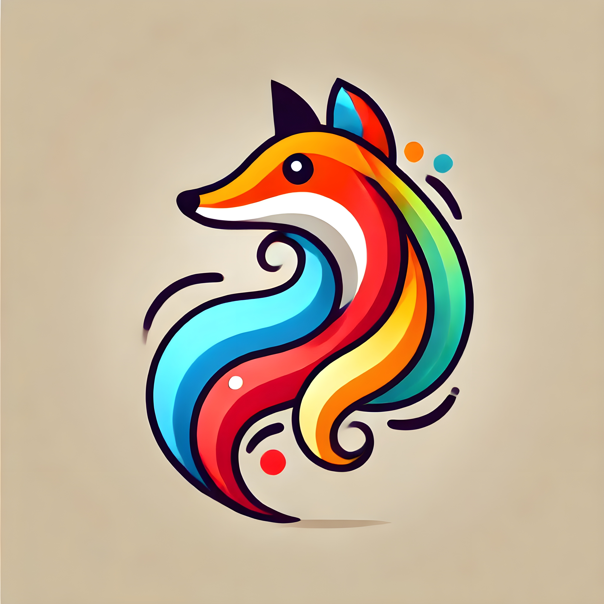

# fotomosaico2.0
Uma versão nova do antigo repositorio fotomosaico,mais versatil, mais rapido e muito mais complexo.

## Um pouco de historia

O foto mosaico foi provavlemetne uns dos primeiros projetos da faculdade que eu me diverti fazendo, mas ele tinhas suas muitas limitações, como o uso de arquivos de images sem compressão e não se poder usar bibliotecas. Alem de ter que ser feito exclusivamente em C

Por isso, chega a hora de iniciar a V2, agora com arquivos com 1/200 do tamanho, uma linguagem menos punitiva e com muito mais bibliotecas de processamento de imagem. e utilizando muitos outros sistemas para dar uma interface e um back end mais robustos.

Alem disso esse projeto tem a ver com o "projeto artisitico 2024", algo que eu faço em anos pares e tem como objetivo dar todas as ferramentas para eu conseguir fazer um fotomosaico na vida real


## Exemplo

<p align="center">
  
  
</p>

#### (imagem original feita com IA)


## dependencias


[Lista completa de dependencias](https://github.com/https://github.com/guipateiro/fotomosaico2.0/requirements.txt)

## Checklist de Tarefas

#### projeto base
- <span style="color:gold; font-size:20px">■</span> fazer gerador manual de pastilhas
- <span style="color:gold; font-size:20px">■</span> fazer o gerador de mosaicos
- <span style="color:red; font-size:20px">■</span> criar o gerenciador de pastilhas
- <span style="color:red; font-size:20px">■</span> gerenciador de mosaicos fisicamente
- <span style="color:red; font-size:20px">■</span> remover os paths hardcoded
#### adicionais 
- <span style="color:red; font-size:20px">■</span> opcoes de escolher tamanho de pastilhas
- <span style="color:red; font-size:20px">■</span> opcao de upscale de imagem nativo
- <span style="color:red; font-size:20px">■</span> criar interface para facilitar o uso
- <span style="color:red; font-size:20px">■</span> opções de polls de pastilhas ou filtragem
#### "eu estou muito motivado"
- <span style="color:black; font-size:20px" >■</span> integração com armazenamento de pastilhas na nuvem
- <span style="color:black; font-size:20px" >■</span> banco de dados com metadados de pastilhas
- <span style="color:black; font-size:20px" >■</span> uso em api 


#### legenda
- <span style="color:green; font-size:20px" >■</span> **Tarefa Concluída**
- <span style="color:gold; font-size:20px">■</span> **Em Andamento** 
- <span style="color:red; font-size:20px">■</span> **Planejado**

## Como Usar

1. Clone o repositório:
   ```bash
   git clone https://github.com/guipateiro/fotomosaico2.0.git
   ```
### todos os comandos a partir da aqui devem ser rodados na pasta root do repositorio

2. Para baixar todas as dependecias
     ```bash
   pip install -r ./requirements.txt 
   ```

3. Para gerar pastilhas
    ```bash
   python.exe .\pastilhes.py 
   ```
   sim, ta escrito errado pastilhas 

4. Para deixar as partilhas do mesmo tamanho
    ```bash
   python.exe .\normalizador.py
   ```

5. Para fazer o mosaico
    ```bash
   python.exe .\fotomosaico.py 
   ```